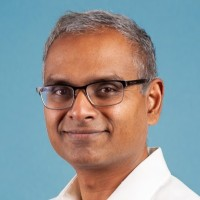

  

I've spent two decades bringing AI technology to life in well engineered products that provide real value to users. Application areas have included security, 2D/3D map building, geospatial analysis, routing, and location. For the last several years at percipient.ai, my teams and I have developed highly loved products 
for national security missions, breaking new ground. Earlier, I led teams composed of scientists, engineers, and PMs  at Uber, Microsoft, Nokia, and Siemens. A list of my publications is [here](https://scholar.google.com/citations?hl=en&user=8unqZVkAAAAJ&view_op=list_works&sortby=pubdate) and patents [here](https://patents.google.com/?inventor=Vasudev+Parameswaran&oq=Vasudev+Parameswaran&sort=new). I received a Ph.D. and a Masters in CS from the University of Maryland, College Park (UMD), both with a focus in computer vision and AI. I received a Masters in Aerospace Engineering, also from UMD, where I developed new computational fluid dynamics methods for rotorcraft flows. I received a Bachelor's degree in Aerospace Engineering from the Indian Institute of Technology, Madras.

